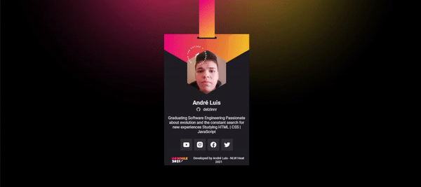

# Cracha-NLW
NLW HEAT - MISSION ORIGIN 2021 (Crachá virtual)

## Preview

  

## Description
This project was carried out at NLW Heat - Mission Origin, in order to improve the basic knowledge in the Front-end.
This week is designed to help those just starting out in programming and those looking to build their foundations.

Basics of HTML - CSS - JavaScript were used in this project, as well as a library called Vanilla-tilt (I leave here my credits to the developer and his collaborators)
